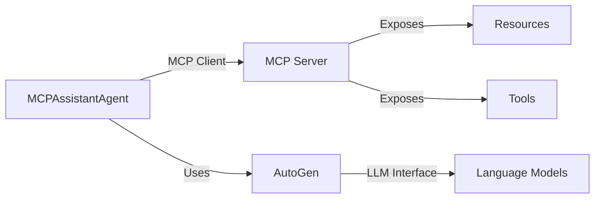

# MCP-AG2 Integration Example

This project demonstrates the integration of the [Model Context Protocol (MCP)](https://modelcontextprotocol.io/) with [AutoGen (AG2)](https://github.com/ag2ai/ag2), showcasing a powerful pattern for building modular, tool-enabled AI agents.

## Overview

The example implements three key components:

1. **MCP Server**: A process that exposes resources and tools following the MCP specification
2. **MCPAssistantAgent**: An AutoGen AssistantAgent extension that implements the MCP client interface
3. **Example Script**: Demonstrates an MCP-enabled agent using LLM capabilities with MCP resources/tools

## Setup

### Prerequisites

1. Install `uv` package manager:
```bash
# macOS
brew install uv

# Other platforms
curl -LsSf https://astral.sh/uv/install.sh | sh
```

### Installation

```bash
# Clone the repository
git clone https://github.com/jtanningbed/mcp-ag2-example
cd mcp-ag2-example

# Install dependencies
uv sync

# Run the example
uv run example.py
```

## Key Benefits

This integration pattern offers several advantages over traditional tool/function calling implementations:

### 1. Unified Interface

- Agents interact with tools and resources through a consistent MCP interface:
  - `read_resource` for accessing resources
  - `call_tool` for executing tools
  - `list_tools` for discovering available tools

### 2. Dynamic Tool Discovery

- Agents automatically discover available tools through the MCP server
- No hardcoding of tool definitions in agent code
- Tools can be added/removed/modified on the server without agent changes
- System messages dynamically inform LLMs about available tools and usage patterns

### 3. Protocol-Level Abstraction

- Separates tool definition from tool implementation
- Server handles tool execution details
- Clients focus on high-level interaction patterns
- Supports both synchronous and asynchronous operations

### 4. Model Agnosticism

- Works with any LLM that supports tool/function calling
- MCP tools use Anthropic's schema format
- Automatic conversion to model-specific formats (e.g., OpenAI)
- Tool execution handled by MCP client-server interface

### AutoGen-Specific Benefits

When compared to traditional AutoGen tool implementations:

1. **Decoupled Architecture**
   - Tools live in MCP servers rather than agent code
   - Multiple agents can share the same tool infrastructure
   - Easier maintenance and updates

2. **Enhanced Reusability**
   - MCP servers can be used by any MCP-compatible client
   - Tools aren't tied to specific agent implementations
   - Consistent interface across different agent types

3. **Simplified Agent Development**
   - Agents only need to implement MCP client interface
   - Tool discovery and execution handled by protocol
   - Reduced boilerplate code

## Architecture Overview



## Contributing

Contributions are welcome! Please feel free to submit a Pull Request.
