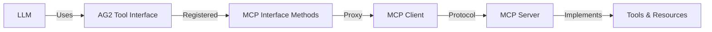

# MCP-AG2 Integration Example

This project demonstrates the integration of the [Model Context Protocol (MCP)](https://modelcontextprotocol.io/) with [AutoGen (AG2)](https://github.com/ag2ai/ag2), showcasing a powerful pattern for building modular, tool-enabled AI agents.

## Overview

The example implements three key components:

1. **MCP Server**: A process that exposes resources and tools following the MCP specification
2. **MCPAssistantAgent**: An AutoGen AssistantAgent extension that implements the MCP client interface
3. **Example Script**: Demonstrates an MCP-enabled agent using LLM capabilities with MCP resources/tools

## Setup

### Prerequisites

1. Install `uv` package manager:
```bash
# macOS
brew install uv

# Other platforms
curl -LsSf https://astral.sh/uv/install.sh | sh
```

### Installation

```bash
# Clone the repository
git clone https://github.com/jtanningbed/mcp-ag2-example
cd mcp-ag2-example

# Install dependencies
uv sync

# Run the example
uv run example.py
```

## Key Benefits

This integration pattern offers several advantages over traditional tool/function calling implementations:

### 1. Protocol-Level Interface Abstraction

- The MCP client interface itself (`read_resource`, `call_tool`, etc.) is exposed to the LLM agent through AG2's tool registration
- Rather than registering individual tools directly with AG2, we register only the core MCP interface methods
- All specific tools (e.g., `write_file`) are proxied through the `call_tool` interface to the MCP server
- This means tools defined on the MCP server don't need any format conversion for different LLMs - they remain in Anthropic schema format

### 2. Dynamic Tool Discovery and Model Agnosticism

- Agents use `list_tools` to discover available server tools
- While the MCP server defines tools using Anthropic's schema format, the LLM never sees these directly
- The LLM only needs to understand how to use `call_tool` with a name and arguments
- No need to convert tool schemas between different LLM formats since they're abstracted behind the MCP interface

### 3. Clean Separation of Concerns

- MCP server handles:
  - Tool implementation details
  - Tool schema definitions (in Anthropic format)
  - Resource management
- Agent only handles:
  - Understanding the core MCP interface methods
  - Using `call_tool` to proxy specific tool requests to the server
- LLM integration layer only handles:
  - Registering MCP interface methods as tools (e.g., `call_tool` in OpenAI format)
  - Routing tool calls through the MCP client

### AutoGen-Specific Benefits

When compared to traditional AutoGen tool implementations:

1. **Simplified Tool Integration**
   - No need to define tool schemas in multiple formats
   - Tools are defined once on the MCP server in Anthropic format
   - AG2 only needs the `call_tool` interface registered

2. **Enhanced Modularity**
   - MCP servers can be used by any MCP-compatible client
   - Tools and resources are completely decoupled from agent implementation
   - New tools can be added to the server without any agent changes

## Architecture Overview


