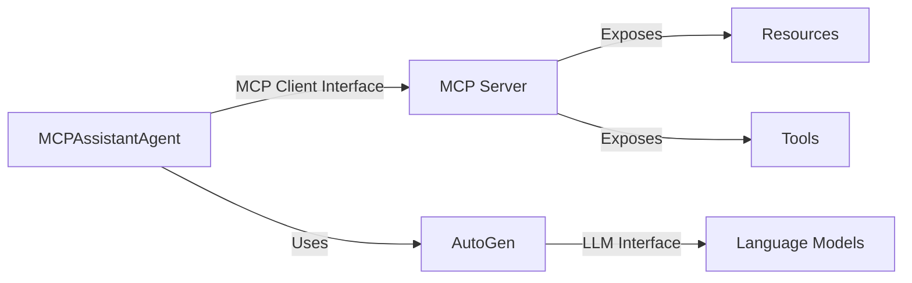

# MCP-AG2 Integration Example

This project demonstrates the integration of the [Model Context Protocol (MCP)](https://modelcontextprotocol.io/) with [AutoGen (AG2)](https://github.com/ag2ai/ag2), showcasing a powerful pattern for building modular, tool-enabled AI agents.

## Overview

The example implements three key components:

1. **MCP Server**: A process that exposes resources and tools following the MCP specification
2. **MCPAssistantAgent**: An AutoGen AssistantAgent extension that implements the MCP client interface
3. **Example Script**: Demonstrates an MCP-enabled agent using LLM capabilities with MCP resources/tools

## Setup

### Prerequisites

1. Install `uv` package manager:
```bash
# macOS
brew install uv

# Other platforms
curl -LsSf https://astral.sh/uv/install.sh | sh
```

### Installation

```bash
# Clone the repository
git clone https://github.com/jtanningbed/mcp-ag2-example
cd mcp-ag2-example

# Install dependencies
uv sync

# Run the example
uv run example.py
```

## Key Benefits

This integration pattern offers several advantages over traditional tool/function calling implementations:

### 1. Protocol-Level Interface Abstraction

- The entire MCP client-server interface (`list_resources`, `read_resource`, `list_tools`, `call_tool`, `list_prompts`, etc.) is exposed as tools to the LLM agent
- Agents only need to understand how to use these protocol-level functions
- Any resources or tools exposed through the MCP server automatically become available to the agent without defining individual tool functions
- Server handles all implementation details of tools and resources

### 2. Dynamic Tool Discovery

- Agents automatically discover available tools through the MCP server's `list_tools` interface
- No hardcoding of tool definitions in agent code
- Tools can be added/removed/modified on the server without agent changes
- System messages dynamically inform LLMs about available tools and usage patterns

### 3. Model Agnosticism

- Works with any LLM that supports tool/function calling
- MCP tools use Anthropic's schema format
- Automatic conversion to model-specific formats (e.g., OpenAI)
- Tool execution handled by MCP client-server interface

### AutoGen-Specific Benefits

When compared to traditional AutoGen tool implementations:

1. **Decoupled Architecture**
   - Tools and resources live in MCP servers rather than agent code
   - Multiple agents can share the same tool infrastructure
   - Agents only need to implement the MCP client interface functions

2. **Enhanced Reusability**
   - MCP servers can be used by any MCP-compatible client
   - Tools and resources aren't tied to specific agent implementations
   - Protocol-level abstraction provides consistent interface across different agent types

## Architecture Overview


